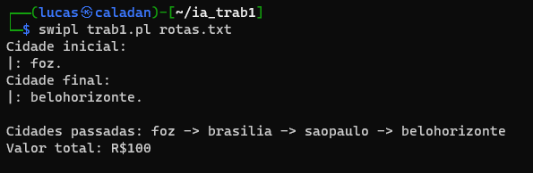

# Trabalho 1 de Inteligência Artificial 

Este é um programa desenvolvido em Prolog com o objetivo de encontrar o caminho de menor preço entre duas cidades, permitindo a passagem por outras cidades ao longo do trajeto.

O arquivo que contém as informações das rotas deve seguir o seguinte formato:

```
rotas(partida, chegada, preço).
```

### Pré-requisitos

Para executar o programa com sucesso, é necessário ter o interpretador do Prolog instalado em seu sistema. Você pode instalá-lo usando o seguinte comando:

```
sudo apt install swi-prolog-core
```

### Como Usar

Para começar, você precisa clonar este repositório:

```
git clone https://github.com/tomiodarim/IA-trab1.git
```

Em seguida, você pode executar o programa da seguinte maneira. Substitua <arquivo de entrada> pelo arquivo que contém as informações das rotas que você deseja utilizar:

```
swipl trab1.pl <arquivo de entrada>
```

O programa solicitará a cidade de partida e a cidade de chegada. Certifique-se de incluir um ponto final (.) após o nome da cidade. O programa calculará o caminho de menor preço e apresentará o trajeto resultante, bem como o valor total.

